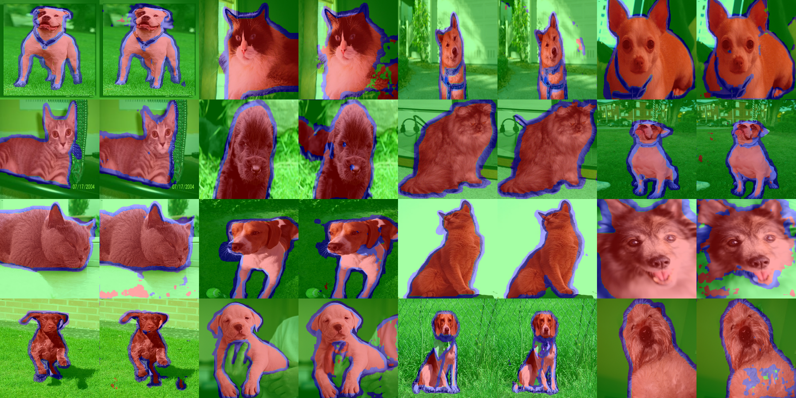

# TF2-UNet
## Usage
- Requirements
    - [Numpy](http://www.numpy.org/)
    - [TensorFlow >= 2.0](https://www.tensorflow.org/versions/r2.0/api_docs/python/tf)
    - [TensorFlow Datasets](https://www.tensorflow.org/datasets/)
    - [TensorFlow Hub](https://www.tensorflow.org/hub)
    
- Training U-Net
    ```bash
    python train.py
    ```

- Test U-Net
    ```bash
    python test.py
    ```
    
- TensorBoard
    ```bash
    tensorboard --logdir log_unet_224
    ```
    
## Results
Results Images


TensorBoard Output


## References
[U-Net: Convolutional Networks for Biomedical Image Segmentation](https://arxiv.org/abs/1505.04597)
[TensorFlow Segmentation Example](https://www.tensorflow.org/beta/tutorials/images/segmentation)